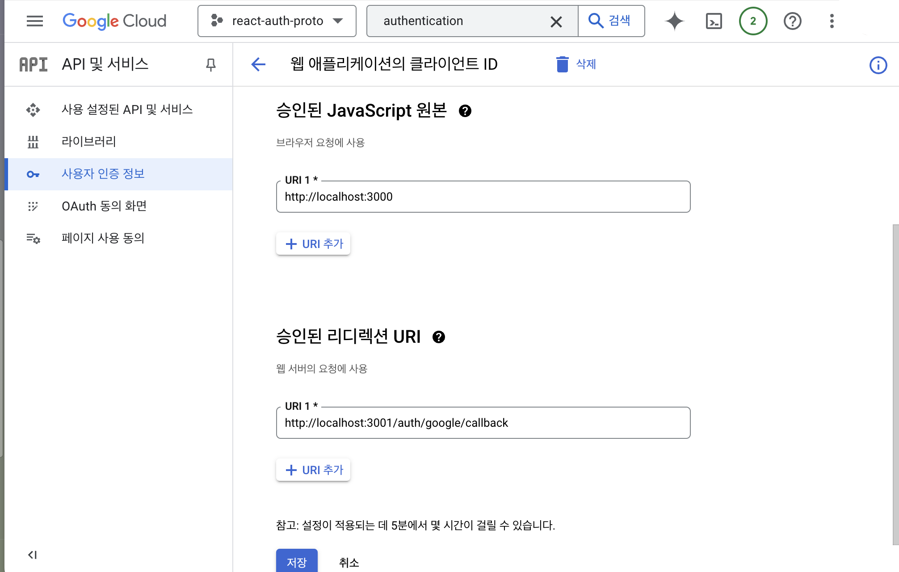

# 판다마켓 백엔드

## 실행하기

### 도커를 통하여 실행하기

도커를 사용하면, 환경에 구애받지 않고 어플리케이션을 쉽게 개발 및 실행할 수 있습니다.

해당 장에서는 도커에 대해 자세하게 설명하지 않습니다.
자세한 사항은 [도커 공식문서](https://docs.docker.com/desktop/)를 참조해주세요.


#### 준비물

- npm
- docker
- cocker-compose

#### 실행하는 방법

```shell
npm run compose
```

docker-compose 를 통해 실행했다면, postgresql 은 도커 내부에 자동적으로 만들어집니다.

아래는 자원의 접근 정보입니다.

**DB**

- `PORT` : 15432 (localhost:15432 으로 접근)
- `USER_NAME` : postgres
- `USER_PASSWORD` : postgres

**Service**

- `PORT` : 13000 (localhost:13000 으로 접근)

그 외에 필요한 환경 변수들은 아래를 참고하여 설정해 주셔야 합니다.


### 로컬 환경에서 실행하기

#### 준비물

- nodejs
- postgresql

#### 실행 전, 필요한 작업

1. `.env` 파일 설정

이미지 업로드시 노출시킬 서버의 주소를 `BASE_URL`로 설정해 주세요. 이때 주소의 마지막에 슬래시(`/`)는 포함하지 않습니다.
서버를 실행할 포트 번호를 `HTTP_PORT`에 원하는 값으로 설정해 주세요. 포트 값을 설정하지 않으면 기본 값은 3000으로 실행됩니다.

```
BASE_URL=http://localhost:3001
HTTP_PORT=3001
```


PostgreSQL 접속정보를 환경변수에 반영해야 합니다.
아래 포맷에 맞추어 `DATABASE_URL` 값을 수정해 주세요.

```
DATABASE_URL=postgresql://{userName}:{password}@{dbHost}:{dbPort}/{dbName}
```

JWT 생성 발급을 위한 시크릿 키와 구글 계정 관련 정보도 설정해 주세요. 이때 CLIENT_REDIRECT_URI는 소셜 로그인을 마치고 인증 토큰을 담은 쿼리 스트링과 함께 클라이언트가 최종 도착할 URI입니다.

```
JWT_ACCESS_TOKEN_SECRET=<사용할 secret key>
JWT_REFRESH_TOKEN_SECRET=<사용할 secret key>
GOOGLE_CLIENT_ID=
GOOGLE_CLIENT_SECRET=
GOOGLE_REDIRECT_URI=
CLIENT_REDIRECT_URI=
```

위에서 필요한 `GOOGLE_CLIENT_*` 값들은 구글 Credentials에서 OAuth 클라이언트를 설정할 때 얻을 수 있습니다.

구글의 Credentials에서 OAuth Client를 생성할 때 `/auth/google/callback` 이라는 경로를 기준으로 허용 승인된 리디렉션 URI를 추가해 주세요.


2. DB 마이그레이션

서비스를 운영하기 위해 필요한 테이블들을 생성해야 합니다.

- Article
- Product
- Comment

```
npx prisma migrate deploy
```

PostgreSQL 접속정보가 올바르지 않다면 실패할 수 있습니다.


3. DB Seeding (옵션)

```
npm run seed
```

4. 의존성 설치

서비스가 동작하기 위해 필요한 라이브러리를 설치합니다.

```
npm install
```

5. Prisma Client 생성

`@prisma/client` 는 로컬의 `schema.prisma` 파일을 읽어서 만들어지는 패키지입니다.
처음 및 스키마 파일이 변경될 때 마다, 아래 명령어를 실행해주세요.

```
npx prisma generate
```

6. 서비스 실행

```
npm start
```

혹은 개발 중 `nodemon`으로 실행하고 싶다면 아래 명령어를 사용하면 됩니다.

```
npm run dev
```
