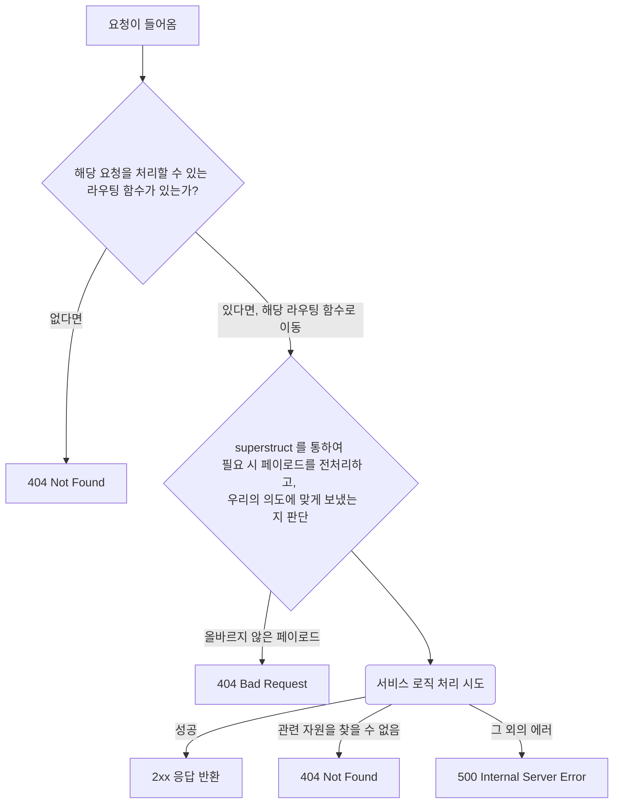

# Router

라우팅이란 클라이언트가 서버의 특정 엔드포인트에 접근했을 때, 서버가 응답하는 방식을 의미합니다.

여기서는 각각의 관심사 별로 라우터를 분리하여 구현하였으며,
이러한 방식은 코드의 유지보수를 쉽게 할 수 있도록 도와줍니다. 

**관심사 별로 라우터를 분리한 예시**

- ArticleRouter
- CommentRouter
- ImageRouter
- ProductRouter

**어떤 측면에서 유지보수가 좋아지나요?**

- 각 라우터 하나하나의 라인수가 너무 커지는 것을 방지
- 한 라우터를 수정 시, 다른 라우터에 영향이 가는 것을 방지
- 여러 개발자가 동시에 협엽 시, 버전 관리 충돌을 최소화 할 수 있음
- 각 라우터별로 최적화된 미들웨어를 사용하여, 접근제어나 캐싱전략을 다르게 가져갈 수 있음

## 요청 플로우

해당 어플리케이션에서는 클라이언트의 요청이 들어왔을 때, 다음과 같이 처리합니다.

### 유효성을 검사하기 전에, 페이로드 전처리는 왜 필요한가요?

전처리가 필요한 유효성 검사 케이스는 생각보다 흔합니다.

예를 들어,

- 상품 생성 요청 시, ProductName 에는 `앞뒤로 공백이 없어야 하며` 제목이 2글자 이상 되게끔 해주세요.
- 상품 목록 조회 시, cursor 값이 문자열로 오고 있어요, `미리미리 숫자로 바꿔서 사용` 하고 싶어요.
- 상품 목록 조회 시, cursor 값이 명시적으로 주어지지 않았다면 `기본값으로 0을 사용` 하게끔 해주세요.

이러한 전처리는 라우팅 함수 내에서 해도 결과적으로는 문제가 없습니다.

하지만 라우팅 함수가 처리로직에만 집중할 수 있도록,
처리로직 이외의 동작은 다른 코드에 위임하는 것이 좋습니다.
